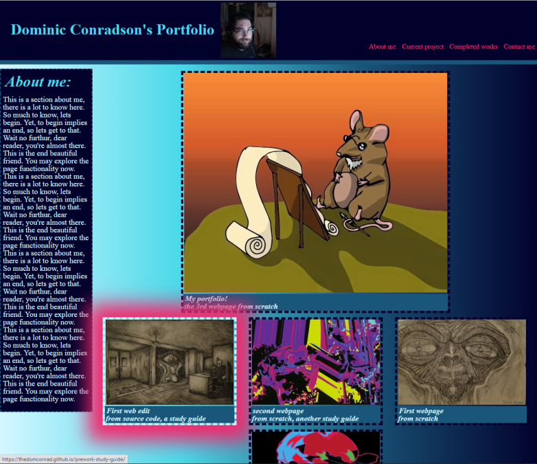
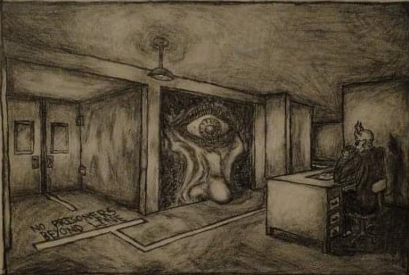

# Dominic-Conradson-Portfolio

## Description

My proffesional dev portfolio showcasing all web apps/designs thus far. Listed from most recent to oldest, join me on this journey. It is and likely will always be a work in progress.

## Sample Usage
Fully responsive layout with a fun pink glow to the images upon cursor hover. Click to your hearts content!


[an actual link to the page](https://thedomconrad.github.io/Dominic-Conradson-Portfolio/)

# Code Snippit
some HTML and CSS of clickable images:

```
<div id="bottom" class="sub-section">
                    
                    <section>
                        <a target="_blank" href="https://thedomconrad.github.io/prework-study-guide/">
                            
                        </a>
                        <h2 class="image-text-link" id="completed-works">
                            <a target="_blank" href="https://thedomconrad.github.io/prework-study-guide/">
                                First web edit
                                <br>from source code, a study guide
                            </a>
                        </h2>
                    </section>

corresponding CSS:

.sub-section { /*necessary wrapper for main content*/
    display: flex;
    flex-wrap:wrap;
}

/*borders for main images start*/
#top section,
#bottom section{
    border-style: dashed;
    border-width: 5px;
    color: var(--ddblue);
    transition: 1.5s ease-in 150ms  /*transition rule*/
}

#top section:hover,  /*our transition color after hover*/
#bottom section:hover {
    border-color: var(--lblue);
    box-shadow: 0px 3px 45px 34px var(--pink);
}

#bottom img { /*sizing for smaller central image links*/
    min-width:300px;
    max-width: 300px;
    max-height: 200px;
    min-height: 200px;
}
```

##Credits
## Author Links
---[Linkedin](https://www.linkedin.com/in/dominic-conradson-76638b172/)---
[GitHub](https://github.com/theDomConrad/)---
[Portfolio](https://thedomconrad.github.io/Dominic-Conradson-Portfolio/)---